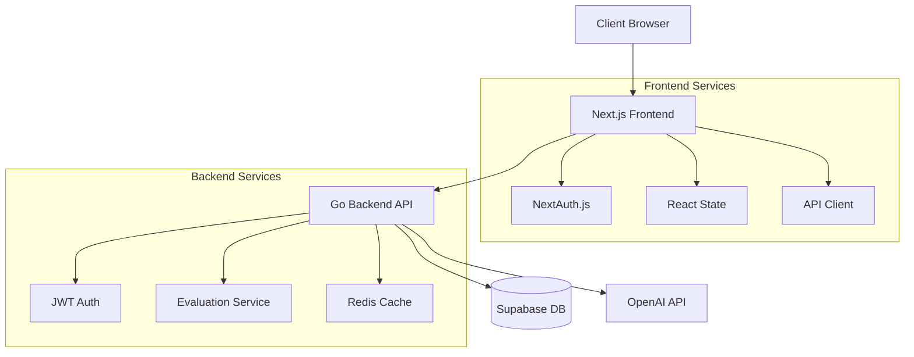
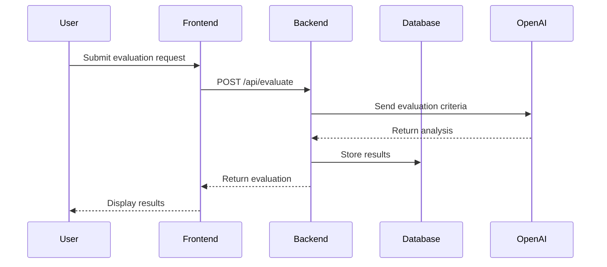
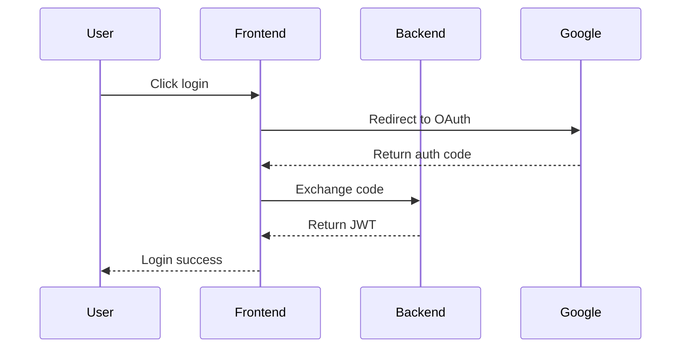

# Architecture Overview

This document outlines the architectural design of the Evaluation System, which consists of a Next.js frontend and Go backend.

## System Architecture



## Component Overview

### Frontend (Next.js)

1. **Authentication Layer**
   - NextAuth.js for authentication
   - JWT token management
   - Protected routes

2. **UI Components**
   - React components
   - TailwindCSS styling
   - Form handling

3. **State Management**
   - React hooks
   - Context API
   - Local storage

4. **API Integration**
   - Axios for HTTP requests
   - Error handling
   - Request/response interceptors

### Backend (Go)

1. **API Layer**
   - RESTful endpoints
   - Middleware chain
   - Request validation

2. **Service Layer**
   - Business logic
   - External API integration
   - Data transformation

3. **Data Layer**
   - Repository pattern
   - Database operations
   - Caching strategy

4. **Authentication**
   - JWT implementation
   - Role-based access
   - Session management

## Data Flow

### Evaluation Flow



### Authentication Flow



## Security Architecture

1. **Frontend Security**
   - CSRF protection
   - XSS prevention
   - Secure cookie handling

2. **Backend Security**
   - JWT validation
   - Rate limiting
   - Input sanitization

3. **Database Security**
   - Row Level Security
   - Encrypted connections
   - Prepared statements

## Performance Considerations

### Frontend Performance

1. **Optimization Techniques**
   - Code splitting
   - Image optimization
   - Lazy loading
   - Caching strategies

2. **Bundle Size**
   - Tree shaking
   - Dynamic imports
   - Component optimization

### Backend Performance

1. **Request Handling**
   - Connection pooling
   - Request timeout
   - Graceful shutdown

2. **Caching Strategy**
   - Redis caching
   - In-memory caching
   - Cache invalidation

## Error Handling

### Frontend Error Handling

```typescript
// Example error boundary
class ErrorBoundary extends React.Component {
    componentDidCatch(error: Error, errorInfo: React.ErrorInfo) {
        // Log error to service
        logError(error, errorInfo);
    }

    render() {
        if (this.state.hasError) {
            return <ErrorFallback />;
        }
        return this.props.children;
    }
}
```

### Backend Error Handling

```go
// Example error middleware
func ErrorHandler(next http.Handler) http.Handler {
    return http.HandlerFunc(func(w http.ResponseWriter, r *http.Request) {
        defer func() {
            if err := recover(); err != nil {
                // Log error and return 500
                log.Error("panic recovered", zap.Any("error", err))
                http.Error(w, "Internal Server Error", http.StatusInternalServerError)
            }
        }()
        next.ServeHTTP(w, r)
    })
}
```

## Scalability

### Horizontal Scaling

1. **Frontend**
   - Vercel edge network
   - Static page generation
   - CDN caching

2. **Backend**
   - Containerization
   - Load balancing
   - Stateless design

### Vertical Scaling

1. **Resource Optimization**
   - Memory management
   - CPU utilization
   - Database indexing

2. **Performance Monitoring**
   - Metrics collection
   - Performance tracking
   - Resource scaling

## Integration Points

### External Services

1. **OpenAI Integration**
   - API key management
   - Rate limiting
   - Error handling

2. **Google OAuth**
   - Authentication flow
   - Token management
   - User data handling

### Internal Services

1. **Database**
   - Connection pooling
   - Query optimization
   - Transaction management

2. **Caching**
   - Cache strategies
   - Invalidation rules
   - Data consistency

## Monitoring and Logging

### Application Monitoring

1. **Metrics**
   - Request latency
   - Error rates
   - Resource usage

2. **Logging**
   - Structured logging
   - Log levels
   - Log aggregation

### Performance Monitoring

1. **Frontend**
   - Page load times
   - Client-side errors
   - User interactions

2. **Backend**
   - API response times
   - Database queries
   - External API calls

## Development Workflow

### Local Development

1. **Setup**
   - Docker compose
   - Hot reloading
   - Debug tools

2. **Testing**
   - Unit tests
   - Integration tests
   - E2E tests

### Deployment

1. **CI/CD**
   - Automated testing
   - Build process
   - Deployment stages

2. **Environment Management**
   - Configuration
   - Secrets
   - Variables

## Future Considerations

1. **Scalability**
   - Microservices architecture
   - Event-driven design
   - Message queues

2. **Features**
   - Real-time updates
   - Websocket support
   - Analytics integration

3. **Performance**
   - Edge computing
   - GraphQL adoption
   - Database optimization

## Practice Question Data Management

Currently, practice questions are sourced from a static JSON file (`public/data/practice-sets.json`). While this is suitable for the initial version, it has limitations for scalability, advanced search/filtering, and content management (e.g., CRUD operations for questions by administrators).

**Future Recommendation:**
If the question bank is expected to grow significantly or if more advanced features (e.g., admin interface for managing questions, complex querying, user-generated content, linking questions to specific learning objectives) are desired, it is strongly recommended to migrate these questions into a dedicated database table.

A new Prisma model, for example `PracticeQuestionData`, could be created with fields such as:
- `id` (globally unique identifier)
- `text` (the question content)
- `type` (e.g., 'text', 'multiple_choice')
- `hints` (array of strings or JSON)
- `categories` (array of strings or relation to a Category table)
- `difficulty` (enum: 'beginner', 'intermediate', 'advanced')
- `options` (for multiple choice, array of strings or JSON)
- `correctAnswer` (string or JSON)
- `explanation` (string)
- `sourceSetId` (optional, to link back to an original set if needed for organization)
- `createdAt`, `updatedAt`

**Benefits of Database Migration:**
- **Improved Data Management:** Centralized and structured storage, easier updates, and data integrity.
- **Enhanced Query Performance:** Efficient querying for large datasets, enabling complex filtering and sorting.
- **Scalability:** Better support for a growing number of questions and users.
- **Easier Admin Interface Development:** Standard CRUD operations can be built more easily on top of a database table.
- **Relational Capabilities:** Ability to link questions to other data entities (e.g., authors, sources, user progress at a granular level).

The action functions `getAllQuestions()` and `getPracticeSets()` in `src/actions/practice.ts` would then be refactored to fetch data from this new database table instead of the JSON file.